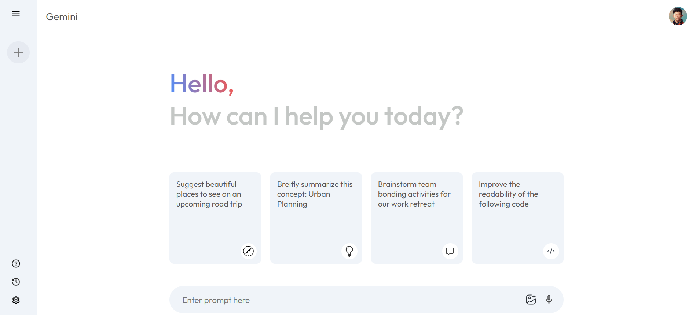

# Gemini Clone - Frontend with API Integration



## Overview

This is a frontend-only Gemini clone that integrates with the Gemini API. The purpose of this project is to mimic the functionalities of Gemini's interface and interactions, allowing users to send and receive prompts while tracking previous prompts and responses. 

## Features

- **User-friendly Interface:** Designed with simplicity and ease of use in mind.
- **Gemini API Integration:** Connects to the Gemini API to handle prompts and retrieve responses.
- **Prompt History:** Stores and displays a list of previous prompts for user reference (unless you refresh).
- **Responsive Design:** Fully responsive, ensuring compatibility across various devices.


## Getting Started

To get a local copy up and running, follow these simple steps.

### Prerequisites

- Make sure you have [Node.js](https://nodejs.org/) installed.

### Installation

1. **Clone the repo**
   ```bash
   git clone https://github.com/ghnsym/Gemini-Clone.git
